# Android Drawable Importer Plugin

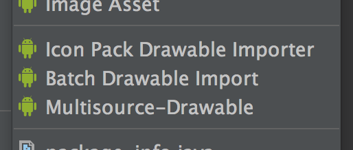

This plugin consists of 4 main features. You can access them by **right-clicking** anywhere, but **not** on a file, inside an **Android (library) module** under **New**.

## AndroidIcons and Material Icons Drawable Import
You are able to select the asset, specify your color, change the target resource name and select all the resolutions you want to import.  

All the missing folders will be created automatically. If there are already drawables with the same name, you will be warned.  

You can even search for your desired asset.

*Currently Material Icons 2.0 is not supported, but it will be added soon.*
   
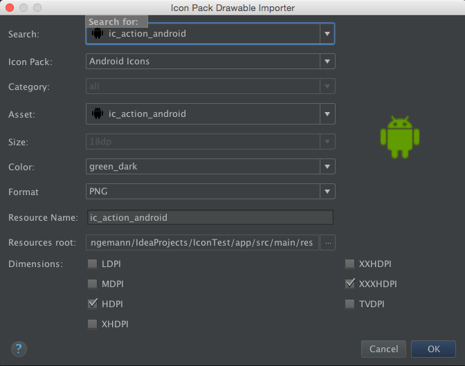
   
*You can download AndroidIcons [here](http://www.androidicons.com/) and Material Icons [here](https://github.com/google/material-design-icons) for free.*

## Batch Drawable Import  
Select an asset and specify the source resolution. You can change the source size of the image as well. Specify all resolutions, to which the drawable should be resized to.  

This also works with 9-Patch-Images. But take care: sometimes it's necessary to remove / add about one "pixel" in the 9-Patch-Editor. But just try it :)  
   
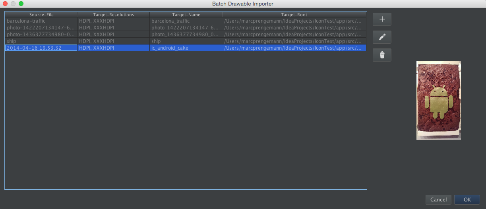
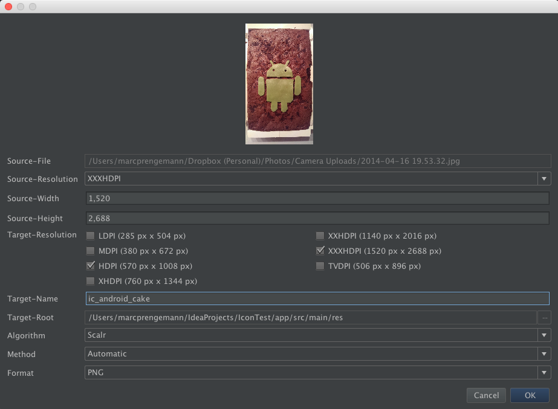

## Multisource-Drawable
Ever got a zip with drawables for your Android project by your designer with the following structure?  
   
```
  root/
       ./drawable_ldpi.png
       ./drawable_mdpi.png
       ./drawable_hdpi.png
       ./drawable_xhdpi.png
```
            
No problem! Now you can just select for every resolution a different asset, specify one name for them, and the rest is done by the plugin.
   
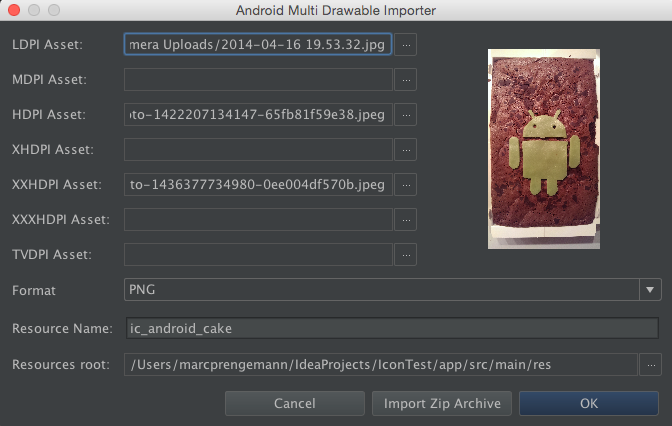

*Hint: When you select an asset, you can also just drag a file from your finder / explorer to the text field and drop it there.*

## Install Instructions (IntelliJ, Android Studio)

**Step 1:**

Open IntelliJ and click on the *Configure* button on the welcome screen.

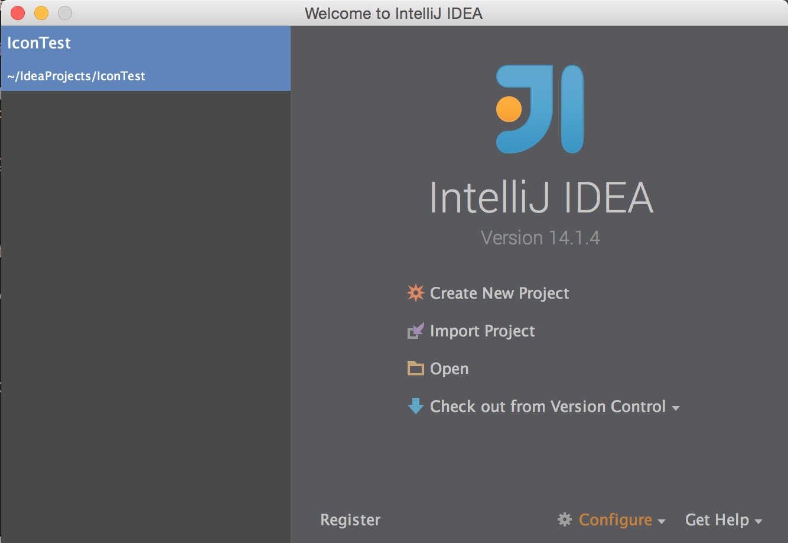

Then click on the *Plugins* button to open the Plugins dialog.

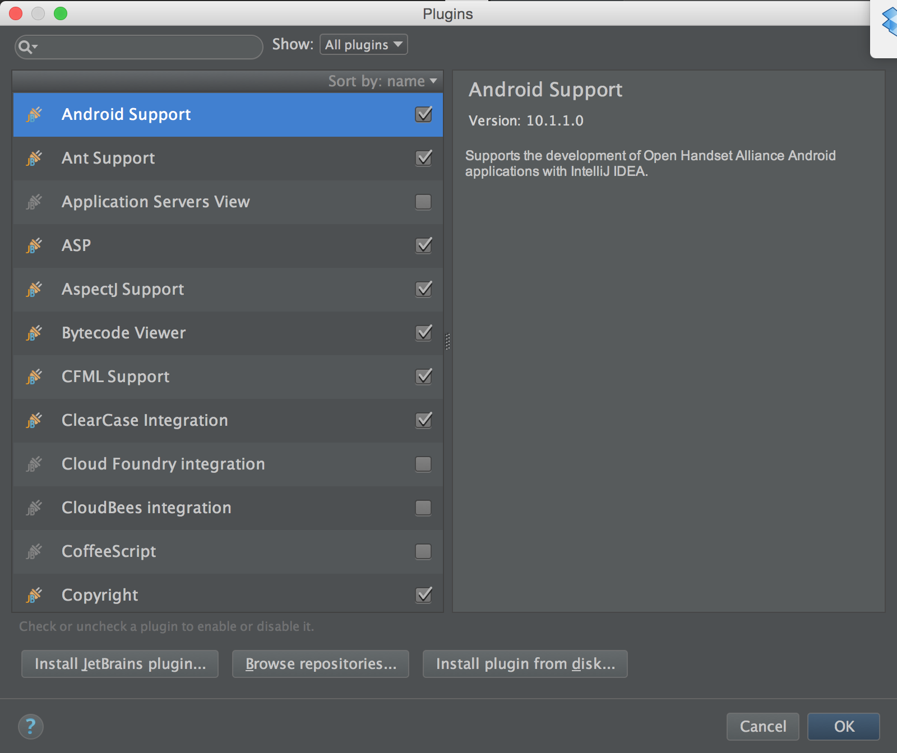

If your IntelliJ is already opened or was closed with an open project, go to the *Settings* in the *File* menu on Windows or the *Preferences..* in the *IntelliJ IDEA* menu. Select the *Plugins* option on the left pane.

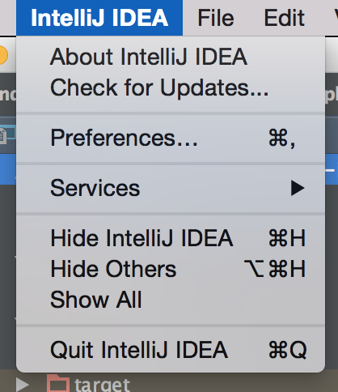
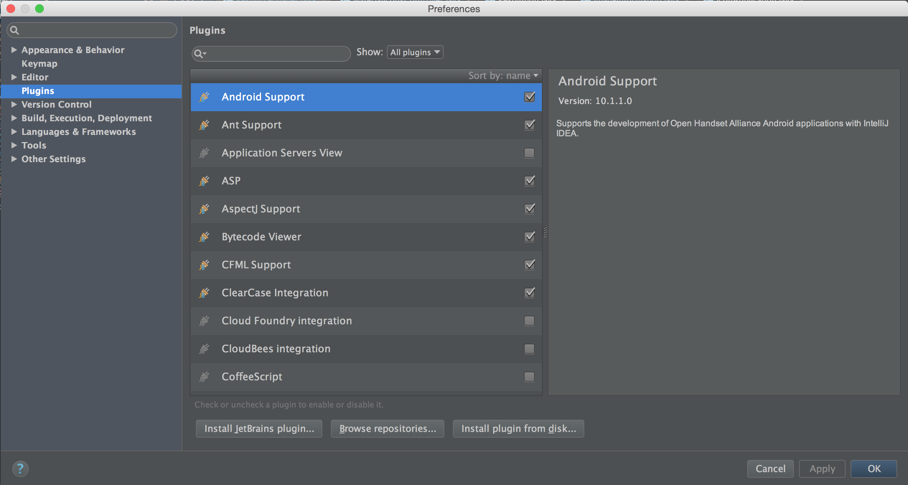

**Step 2:**

Click on the **Browse repositories...** button.


**Step 3:**

Search for **Android Drawable Importer** and select the plugin from the list. Click on the *Install Plugin* button and verify the selection by pressing *Yes* afterwards.

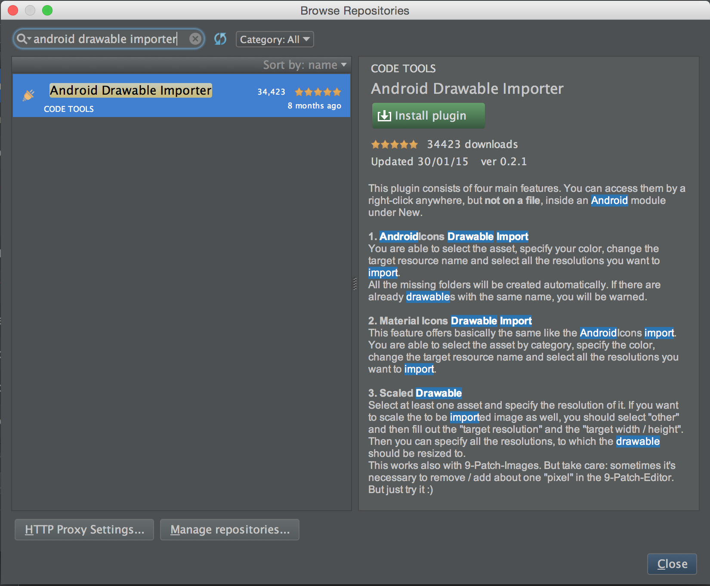
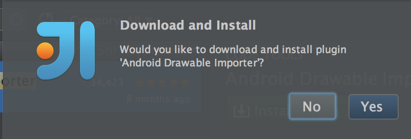

**Step 4:**

Afterwards click on the *Close* button. If IntelliJ asks you to restart, allow it.

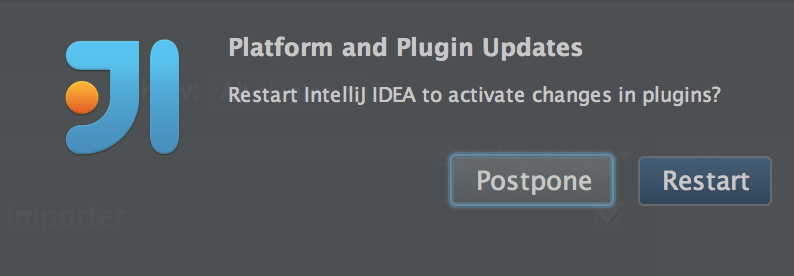

# How to run the repository code

1. Clone
  `git clone git@github.com:winterDroid/android-drawable-importer-intellij-plugin.git`
2. Run Gradle Wrapper In project root.
  `./gradlew runIdea`

# Contribution

1. Fork it
2. Checkout develop branch
  `git checkout develop && git pull`
2. Create your feature branch 
  `git checkout -b my-new-feature`
3. Commit your changes 
  `git commit -am 'Add some feature'`
4. Squash all commits in your branch together 
  `git rebase -i develop`
5. Push to the branch 
  `git push origin my-new-feature`
6. Create new *Pull Request*

# License

Copyright 2014 Marc Prengemann

Licensed under the Apache License, Version 2.0 (the "License");
you may not use this file except in compliance with the License.
You may obtain a copy of the License at

    http://www.apache.org/licenses/LICENSE-2.0

Unless required by applicable law or agreed to in writing, software
distributed under the License is distributed on an "AS IS" BASIS,
WITHOUT WARRANTIES OR CONDITIONS OF ANY KIND, either express or implied.
See the License for the specific language governing permissions and
limitations under the License.
